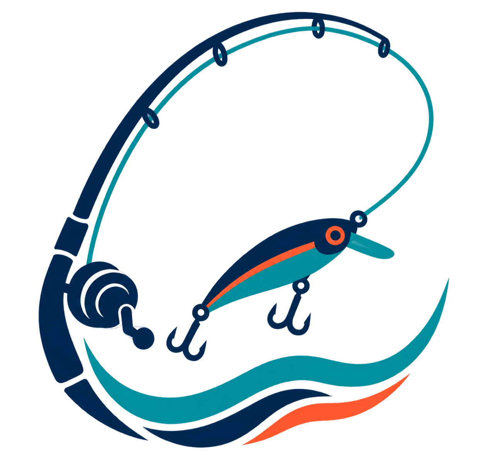

# alerts.fishing

  
  
<em>Provisional visual concept — not the final identity.</em>

`alerts.fishing` will help anglers decide when, where, and how to fish, understand the conditions, prepare the right gear, and learn from the community. It will start in Galicia and expand progressively.

The goal is not to display more generic weather data, but to turn it into a local fishing decision that is easy to understand and evaluate.

> **Current status:** product specification and design. The application has not been implemented yet.

## What we want to build

- [x] Galicia defined as the initial territory.
- [ ] Fishing spots and opportunity map.
- [ ] Best fishing windows with clear explanations of the conditions.
- [ ] Species, seasons, restrictions, and local regulations.
- [ ] Personalized alerts.
- [ ] Gear recommendations, tutorials, and step-by-step knots.
- [ ] A safe community for sharing catches.
- [ ] Web application and future iOS and Android versions.
- [ ] Progressive expansion across the rest of Spain.

## Initial scope

The first validation focuses on European seabass and shore spinning in Rías Baixas, with a 72-hour horizon and three demonstration spots: Aguete, Praia do Santo (Seixo), and Placeres/Lourizán. The first vertical slice will use data clearly identified as mock data.

## Documentation

The source of truth is [docs/Home.md](docs/Home.md). It can be read on GitHub or opened as an Obsidian vault without required plugins.

- [Product vision](docs/product/vision.md)
- [Initial scope](docs/product/initial-scope.md)
- [Planned architecture](docs/architecture/overview.md)
- [MVP specification](docs/specs/001-fishing-opportunity-mvp.md)
- [Roadmap](docs/roadmap/roadmap.md)
- [Decisions](docs/decisions/README.md)
